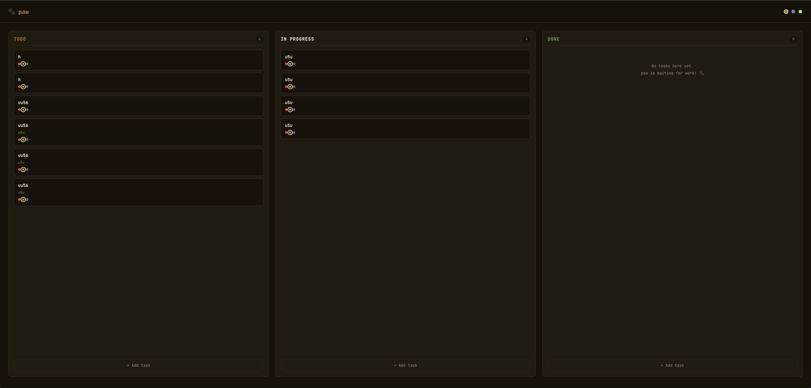

<p align="center">
<pre align="center">
                                            ▃▅
                                           ▁██▁               ▄█▁
                                       ▁▁▂▆▇██▃               ▅█▆
                                      ▅▆█▇▆▄███▆▂         ▁▂▆▇██▇▅▁
                                    ▁▃█▆▁   ▄███▄▁       ▆▇▇▅▄▄███▇▃▁
                                   ▁▃█▄     ▁████▂     ▁▅█▃   ▁▃████▂
                                   ▄█▇▁     ▂████▄▁   ▁▃█▇     ▁████▅▂
                                   ▅█▆      ▂█████▁   ▄█▇▁      ▂████▃
                        ▂▁         ▆█▆      ▂█████▁   ▄█▇      ▁▂████▂
                      ▁▅█▂         ▆█▆▁   ▁▃▇████▆▁   ▄█▇     ▂▄█████▂
                      ▁██▄▂        ▂██▇▆▃▄▇██████     ▄██▄▇▇▃▃▆█████▁
                     ▂█████▇▅▂▁    ▁▄▇█████████▆▂     ▃▇████████████▁        ▁▂▁
                    ▄█▇▃  ▁███▆▁     ▁▃▆▇▇▇▇▃▄▂        ▂▆█████████▅         ▁▇█▂
                   ▃▆▄▁    ▅███▆▃                         ▄▄▅▅▅▅▂▁       ▂▄▃▄██▂
                   ▆█▄     ▃████▄           ▁▄▄██████▄▃▃▂            ▁▂▆▇▇▆████▇▁
                   ▆█▄      ▂████▄        ▂▅▇▇▅▅▁▃▅█▇████▆▂         ▅▇▇▅▄▁ ▂▆████▂
                   ▇█▄      ▅████▄        ▇█▄     ▁▃▇▆████▇▂      ▂▃█▇▃ ▁    ▃███▂
                   ▇██▅   ▂▆████▄▁       ▆█▄▁ ▁    ▅▄▅█████▅      ▆█▆▂      ▃▆███▁
                   ▁████████████▃       ▂▇▆▂         ▄█████▆     ▃██▂      ▂▆███▆
                    ▃█████████▅▂        ██▂          ▄█████▆     ▅██▁     ▁████▇
                      ▂▄▄▄▄▄▄          ▇█▃▁         ▁▅█████▅     ▃██▄▇▆▁▁▄▇████▆
                                   ▁▁▁▇█▂▁ ▁        ▄██████▆▂     ▇███████████▅▁
                               ▁▁▄▅▆██▅▂  ▁▁        ▄███████▄      ▄▅██████▆▅▂
                              ▄██▆▅▄▂▁  ▁           ▃▆██████▇▄▂      ▁▁▁▁▁▁▁
                            ▂██▄▁▁                   ▁▄▅██████▇▆▂▁
                           ▃▇▇▂    ▁▁                  ▁ ▃▇██████▇▃▁
                          ▁▄█▆   ▁                        ▁▆█▇█████▆▂
                          ▄██▇                             ▃▅███████▅▁
                          ▄██▇▁       ▂▂▂▁▁▂▆▇▇▇▇▇▃▁       ▄▆▄▂▇█████▃
                          ▃▇██▇▃   ▁▂▆▆██▆▇█████████▆▄▁▁  ▁▁▁▄▇██████▃
                           ▄█████▆▆▇███████████████████▆▃▁ ▁▄▇███████▃
                           ▁▅█████████████████████████████▅█████████▄▁
                            ▁▂▆█████████████████████████████████████▂
                              ▁▂▆▆▆▆▆▆▃▂▂▂▂▂▂▂▂▂▂▂▂▂▅▆███████████▇▆▁
                                                      ▃▃▇▇▇▇▇▇▇▃▃

                                █▀▀█░█▀▀▄░█▀▀▀░█▄ █░█▀▀▄░▄▀▀▄░█   █░
                                █  █░█▀▀ ░█▀▀ ░█ ▀█░█▀▀ ░█▀▀█░█ █ █░
                                ▀▀▀▀░▀   ░▀▀▀▀░▀  ▀░▀   ░▀  ▀░ ▀ ▀ ░
                               ░░░░░░░░░░░░░░░░░░░░░░░░░░░░░░░░░░░░░░
</pre>
</p>

<h1 align="center">OpenPaw</h1>
<p align="center"><b>Personal Assistant Wizard for Claude Code</b></p>
<p align="center"><i>*wags tail furiously* — your new best friend is here.</i></p>

<p align="center">
  <a href="https://www.npmjs.com/package/pawmode"></a>
  <a href="https://github.com/daxaur/openpaw/blob/main/LICENSE"></a>
  <a href="https://github.com/daxaur/openpaw"></a>
  
</p>

---

## Quick Start

```bash
npx pawmode
```

Pick your skills. Choose terminal, Telegram, or both. Claude does the rest. Good boy.

```bash
# Skip the wizard with a preset
npx pawmode --preset essentials
npx pawmode --preset developer --yes
```

---

## What is OpenPaw?

OpenPaw turns **Claude Code** into a full personal assistant. One command, 39 skills, and a really good boy who fetches your emails, plays your music, and controls your smart home.

```
npx pawmode
  ┌───────────────────────────────────────┐
  │  How should we set things up, human?  │
  │                                       │
  │  > ⚡ Quick Setup (pick a preset)     │
  │    🎯 Custom (sniff through skills)   │
  └───────────────────────────────────────┘

  How do you want to talk to Claude? 🐾
  > 🖥  Terminal only
  > 🖥📱 Terminal + Telegram

  ✔ Sniffed out Homebrew taps
  ✔ Taught Claude new tricks
  ✔ Buried treats in ~/.claude/skills/
  ✔ Set up the doggy door (permissions)
  ✔ Put up the baby gate (safety hooks)
  ✔ All done! *tail wag intensifies*
```

Then just talk to Claude — from your terminal or your phone:

```
> "What emails did I get today?"
> "Play lo-fi on Spotify"
> "Turn the bedroom lights to 20%"
> "What's on my calendar tomorrow?"
> "Go to hacker news and summarize the top 5 posts"
```

**No daemon.** OpenPaw runs once, writes config, gets out of the way. No subscriptions. No extra cost. Just a wizard that sets things up and takes a nap.


---

## What's New in v1.2.0

- **Task Dashboard** — local kanban board with 3 themes (Paw, Midnight, Neon), drag-and-drop, runs on `localhost:3141`
- **3D ASCII Title** — extruded block-character title with depth effect
- **Overwrite Protection** — existing SOUL.md and skills are preserved unless you choose to update them
- **4 New Skills** — Weather, Clipboard, Contacts, Timer
- **Dependency Resolution** — skills that need other skills auto-install them

---

## Task Dashboard

A local kanban board for your assistant. No accounts, no cloud — just a tiny server on your machine.

```bash
openpaw dashboard                    # Start + open browser
openpaw dashboard --theme midnight   # Switch theme
openpaw dashboard --port 8080        # Custom port
```

**3 themes:**
- **Paw** — warm brown tones (`#b4783c`)
- **Midnight** — cool dark blue (`#6688cc`)
- **Neon** — cyber green on black (`#00ff88`)

Features: drag-and-drop kanban, inline editing, priority dots, persistent JSON storage. The wizard asks if you want a dashboard during setup.



---

## Telegram Bridge

Talk to Claude from your phone. Full bidirectional. All your skills available as bot commands.

```bash
# Set up during the wizard, or separately:
openpaw telegram setup

# Start the bridge:
openpaw telegram
```

**Bot commands** (auto-generated from your skills):
- `/email check my inbox`
- `/music play some jazz`
- `/notes add grocery list`
- `/model sonnet` / `/model opus` / `/model haiku` — switch models on the fly
- `/skills` — see what's installed
- `/stop` — cancel current operation
- `/clear` — fresh start

Or just send a regular message. Claude figures out which skill to use.

---

## Smart Scheduling

Automate recurring tasks with built-in cost control. No runaway bills.

```bash
# Morning briefing to Telegram
openpaw schedule add "weekdays 8am" --run "check email and summarize" --delivery telegram

# Evening project summary
openpaw schedule add "daily 6pm" --run "summarize today's git commits" --delivery file

# Urgent email monitor (cheap with Haiku)
openpaw schedule add "every 30 minutes" --run "check for urgent emails" --model haiku --budget 0.25
```

**Cost control built in:**
- Daily cap: $5/day by default (configurable)
- Per-run budget: $1.00 default
- Jobs auto-skip if cap would be exceeded
- Track spending: `openpaw schedule costs`

Jobs run via launchd (macOS) or cron (Linux) — they keep running even when your terminal is closed.

---

## PAW MODE

When you launch Claude through OpenPaw, it runs in **PAW MODE** — full personal assistant mode. Claude knows your name, your preferences, what skills are installed, and greets you at session start.

PAW MODE is established through:
- `~/.claude/SOUL.md` — your personality config
- `~/.claude/skills/c-core/SKILL.md` — the coordinator brain
- `~/.claude/memory/` — persistent facts across sessions

---

## Presets

Get started fast with a preset, or choose `Custom` to sniff through skills one by one.

| Preset | Skills |
|---|---|
| **Everything** | All 39 skills for your platform |
| **Essentials** | Email, calendar, notes, music, weather, clipboard, browser, system, notifications |
| **Productivity** | Notes, Obsidian, tasks, email, calendar, Slack, cloud files, notifications |
| **Developer** | GitHub, Linear, Jira, browser, network, AI, cron |
| **Creative & Media** | Music, video, screen, voice, browser, research |
| **Smart Home** | Lights, speakers, Bluetooth, system, display, notifications |

---

## Skills

39 capabilities across 8 categories. Install only what you need.

### Productivity

| Skill | Description | Tools |
|---|---|---|
| `c-notes` | Apple Notes + Reminders | [`memo`](https://github.com/antoniorodr/memo) [`remindctl`](https://github.com/nicklama/remindctl) |
| `c-obsidian` | Obsidian vault management | [`obsidian-cli`](https://github.com/yakitrak/obsidian-cli) |
| `c-notion` | Notion pages + databases | [`notion-cli`](https://github.com/litencatt/notion-cli) |
| `c-tasks` | Todoist / Things 3 / Taskwarrior | [`todoist-cli`](https://github.com/sachaos/todoist) [`things-cli`](https://github.com/thingsapi/things-cli) [`taskwarrior`](https://github.com/GothenburgBitFactory/taskwarrior) |

### Communication

| Skill | Description | Tools |
|---|---|---|
| `c-email` | Read, send, search email (Gmail or IMAP) | [`gog`](https://github.com/steipete/gog) [`himalaya`](https://github.com/pimalaya/himalaya) |
| `c-calendar` | Events + scheduling (Google or Apple) | [`gog`](https://github.com/steipete/gog) [`icalBuddy`](https://hasseg.org/icalBuddy/) |
| `c-messaging` | iMessage + WhatsApp | [`imsg`](https://github.com/steipete/imsg) [`wacli`](https://github.com/nicklama/wacli) |
| `c-slack` | Slack channels + DMs | [`slack-cli`](https://github.com/rockymadden/slack-cli) |
| `c-telegram` | Telegram bridge (built-in) | — |

### Media

| Skill | Description | Tools |
|---|---|---|
| `c-music` | Spotify playback + search | [`spogo`](https://github.com/steipete/spogo) |
| `c-video` | YouTube download + convert | [`yt-dlp`](https://github.com/yt-dlp/yt-dlp) [`ffmpeg`](https://ffmpeg.org/) |
| `c-video-edit` | Programmatic video creation | [`remotion`](https://github.com/remotion-dev/remotion) [`editly`](https://github.com/mifi/editly) |
| `c-screen` | Screenshots, OCR, webcam | [`peekaboo`](https://github.com/steipete/peekaboo) [`camsnap`](https://github.com/nicklama/camsnap) |
| `c-voice` | Speech-to-text + TTS | [`sag`](https://github.com/steipete/sag) |

### Smart Home

| Skill | Description | Tools |
|---|---|---|
| `c-lights` | Philips Hue control | [`openhue-cli`](https://github.com/openhue/openhue-cli) |
| `c-speakers` | Sonos speakers | [`sonoscli`](https://github.com/steipete/sonoscli) |
| `c-bluetooth` | Bluetooth devices | [`blucli`](https://github.com/nicklama/blucli) |

### Browser & Automation

| Skill | Description | Tools |
|---|---|---|
| `c-schedule` | Smart scheduling with cost control | built-in |
| `c-briefing` | Daily morning briefing | depends on email + calendar |
| `c-browser` | Headless browser — navigate, click, scrape | [`agent-browser`](https://github.com/nicklama/agent-browser) [`playwright`](https://github.com/nicklama/playwright-cli) |
| `c-cron` | Cron jobs + launchctl services | [`lunchy-go`](https://github.com/nicklama/lunchy-go) |

### System & Files

| Skill | Description | Tools |
|---|---|---|
| `c-clipboard` | Copy, paste, transform clipboard content | built-in |
| `c-contacts` | Search macOS Contacts / Address Book | built-in |
| `c-timer` | Countdown timers, alarms, pomodoro | [`terminal-notifier`](https://github.com/julienXX/terminal-notifier) |
| `c-system` | macOS Swiss Army Knife — volume, wifi, battery, dock | [`m-cli`](https://github.com/rgcr/m-cli) |
| `c-apps` | Mac App Store from CLI | [`mas`](https://github.com/mas-cli/mas) |
| `c-files` | Cloud sync — Google Drive, S3, Dropbox, 70+ providers | [`rclone`](https://github.com/rclone/rclone) |
| `c-display` | Display brightness + safe trash | [`brightness`](https://github.com/nriley/brightness) [`macos-trash`](https://github.com/sindresorhus/macos-trash) |
| `c-notify` | Native macOS notifications | [`terminal-notifier`](https://github.com/julienXX/terminal-notifier) |

### Research & Utilities

| Skill | Description | Tools |
|---|---|---|
| `c-weather` | Weather forecasts and conditions | built-in (curl + [wttr.in](https://wttr.in)) |
| `c-research` | Summarize URLs, PDFs, videos | [`summarize`](https://github.com/steipete/summarize) |
| `c-location` | Apple Maps + nearby places | [`goplaces`](https://github.com/steipete/goplaces) |
| `c-tracking` | Package tracking (UPS, FedEx, etc.) | [`ordercli`](https://github.com/steipete/ordercli) |
| `c-secrets` | 1Password / Bitwarden | [`op`](https://developer.1password.com/docs/cli/) [`bw`](https://github.com/bitwarden/clients) |
| `c-network` | DNS lookups + HTTP client | [`doggo`](https://github.com/mr-karan/doggo) [`httpie`](https://github.com/httpie/cli) |
| `c-ai` | Query LLMs — pipe text, chat, summarize | [`llm`](https://github.com/simonw/llm) [`aichat`](https://github.com/sigoden/aichat) |

### Developer

| Skill | Description | Tools |
|---|---|---|
| `c-github` | PRs, issues, repos, actions | [`gh`](https://github.com/cli/cli) [`jq`](https://github.com/jqlang/jq) |
| `c-linear` | Linear issues + projects | [`linear-cli`](https://github.com/linear/linear-cli) |
| `c-jira` | Jira issues + sprints | [`jira-cli`](https://github.com/ankitpokhrel/jira-cli) |

---

## Commands

| Command | Description |
|---|---|
| `openpaw` | Interactive setup wizard |
| `openpaw --preset <name>` | Quick setup with a preset |
| `openpaw --preset <name> --yes` | Non-interactive setup |
| `openpaw --dry-run` | Preview what would be installed |
| `openpaw dashboard` | Start the task manager dashboard |
| `openpaw dashboard --theme <name>` | Change dashboard theme (paw, midnight, neon) |
| `openpaw telegram` | Start the Telegram bridge |
| `openpaw telegram setup` | Configure Telegram bot |
| `openpaw schedule add` | Add a scheduled job |
| `openpaw schedule list` | List scheduled jobs |
| `openpaw schedule costs` | View cost usage and daily cap |
| `openpaw schedule set-cap <usd>` | Set daily cost cap |
| `openpaw list` | Show all available skills |
| `openpaw add <skills>` | Add skills — `openpaw add notes music email` |
| `openpaw remove <skills>` | Remove skills |
| `openpaw status` | Show installed skills + tool versions |
| `openpaw doctor` | Diagnose issues |
| `openpaw update` | Upgrade CLI tools |
| `openpaw soul` | Edit personality (SOUL.md) |
| `openpaw export` | Export config + memory |
| `openpaw import <file>` | Import config from file |
| `openpaw reset` | Remove everything OpenPaw installed |

---

## How It Works

OpenPaw doesn't run in the background (except the optional Telegram bridge). Here's what happens:

```
1. You pick a preset or choose individual skills
2. Pick your interface: terminal, Telegram, or both
3. Optionally set up a task dashboard with your preferred theme
4. CLI tools are installed via brew/npm/pip
5. SKILL.md files are created in ~/.claude/skills/
6. Permissions + safety hooks are configured
7. Telegram bridge is set up (if selected)
8. Claude launches in PAW MODE — ready to fetch!
```

**Skills** are SKILL.md files that Claude auto-discovers. They teach Claude how to use each CLI tool.

**Permissions** let Claude run tools without prompting you every time. Only the minimum needed.

**Safety hooks** block dangerous patterns like mass-delete, mass-email, and credential exposure. Baby gate = installed.

**`--dangerously-skip-permissions`** lets Claude actually be your assistant. The wizard explains this and asks before enabling. Safety hooks still protect you.

---

## The `/c` Coordinator

Every OpenPaw install includes `c-core` — a coordinator skill that acts as the brain. It knows what's installed and routes your requests to the right tool.

```
/c what emails came in today?
/c play something chill on spotify
/c add "buy groceries" to my reminders
/c search my obsidian vault for project ideas
```

---

## tmux Support

For the Telegram bridge (or running "both" mode), OpenPaw can set up a tmux session:

```bash
# The wizard offers this automatically, or:
tmux new-session -s openpaw 'openpaw telegram'
```

In "both" mode, tmux splits into two panes — Claude Code on the left, Telegram bridge on the right.

---

## Architecture

```
~/.claude/
├── SOUL.md                    # Personality (name, tone, proactivity)
├── skills/
│   ├── c-core/SKILL.md        # Coordinator brain
│   ├── c-memory/SKILL.md      # Memory management
│   ├── c-email/SKILL.md       # Email skill
│   ├── c-music/SKILL.md       # Spotify skill
│   └── ...                    # More skills
├── memory/
│   ├── MEMORY.md              # Persistent facts
│   ├── journal.md             # Session logs
│   ├── people.md              # Contact notes
│   └── preferences.md         # User preferences
└── settings.json              # Permissions + hooks

~/.config/openpaw/
└── dashboard.json             # Dashboard tasks + theme
```

---

## Contributing

Want to teach this pup a new trick? It's easy:

```bash
# 1. Fork the repo
gh repo fork daxaur/openpaw

# 2. Create your skill template
mkdir skills/c-yourskill
# Write a SKILL.md with YAML frontmatter + usage instructions

# 3. Add tool definitions to the catalog
# Edit src/catalog/index.ts

# 4. Submit a PR
gh pr create
```

### Skill template format

```markdown
---
name: c-yourskill
description: Short description (under 400 chars)
tags: [tag1, tag2]
---

# Your Skill Name

Instructions for Claude on how to use the CLI tool...
```

---

## Why OpenPaw?

- **Free forever** — uses your existing Claude subscription
- **No daemon** — runs once, configures, takes a nap
- **No attack surface** — no open ports, no cloud dependencies
- **5-minute setup** — from zero to personal assistant
- **Telegram built-in** — talk to Claude from your phone
- **Task dashboard** — local kanban board with 3 themes
- **39 skills** — email, music, smart home, GitHub, scheduling, video editing, and more
- **Cost-controlled scheduling** — automate tasks without runaway bills
- **Open source** — MIT license, community-driven

---

## Changelog

### v1.2.0
- Task manager dashboard with 3 themes (Paw, Midnight, Neon)
- 3D ASCII title with extruded depth effect
- Overwrite protection for existing SOUL.md and skills
- 4 new skills: Weather, Clipboard, Contacts, Timer
- Dependency resolution for skill prerequisites
- Dashboard integrated into setup wizard

### v1.1.0
- Smart scheduling with cost control
- Video editing skill (Remotion + Editly)
- Obsidian memory integration
- Daily briefing skill
- Telegram + Discord curl-based bridge
- MCP server setup
- Soul export/import

### v1.0.0
- Initial release
- 32 skills across 8 categories
- Interactive setup wizard with presets
- Telegram bridge
- PAW MODE with SOUL.md personality
- Safety hooks and permission management

---

## License

MIT — do whatever you want with it. Go fetch.

Made with care (and tail wags) by [@daxaur](https://github.com/daxaur)
